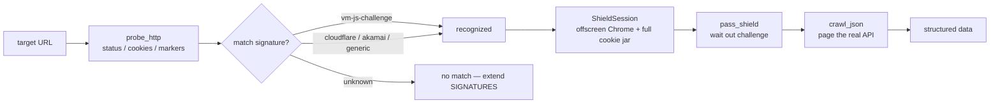

# ShieldProbe 🛡️

**Fingerprint, identify, and bypass dynamic anti-bot protections.**

A Python toolkit for analysing JS-challenge ("dynamic anti-bot") protections. Instead of
hand-reversing each site's obfuscated VM, ShieldProbe helps you **recognize** the
protection family, **catalogue** the environment fingerprints it checks, and **borrow a
real browser session** to pass the challenge and crawl the underlying data.

> 动态反爬（JS 挑战）分析框架：识别反爬类型 → 列出环境指纹检测点 → 借道真实浏览器过盾并抓取数据。中文简介见文末。

[](https://www.python.org/)
[](LICENSE)


---

## Why not just "crack" it?

Dynamic anti-bot protections (RiverSecurity, Cloudflare, Akamai, …) ship a
**self-decrypting JS** that runs a **custom bytecode VM**, collects **environment
fingerprints**, computes a cookie, and reloads. Cracking the VM is a moving target —
vendors rotate the obfuscation regularly, so a "crack" is dead on arrival.

ShieldProbe takes a different stance: **identify, don't defeat.** It answers three
questions that actually matter on a job:

1. **What am I looking at?** — match the observable indicators to a protection family.
2. **What does it check?** — enumerate the environment fingerprints a faithful
   reproduction must provide.
3. **How do I get the data anyway?** — drive a real browser past the challenge and reuse
   the authenticated session.

That last point is the pragmatic core: you don't need to reimplement the VM to *use* the
site — you only need the cookies it produces.

## Features

- **Signature library** — recognize VM-based 412 challenges, Cloudflare 5s challenges,
  Akamai Bot Manager, and generic meta-refresh gates from status codes, cookie shapes,
  and JS/HTML markers.
- **Fingerprint catalogue** — a documented list of environment checkpoints observed in
  the wild (`navigator.webdriver`, canvas/WebGL, `Function` constructor, `Proxy` /
  `queueMicrotask`, screen, timer behaviour) with *why* each is checked and *how*.
- **Shield session** — launch an offscreen Chrome (system Chrome, not the automation
  fingerprint of the bundled Chromium), wait out the challenge, then reuse the **full
  cookie jar** through `ctx.request`.
- **Paginated crawl** — a generic JSON-pagination loop that walks every page until the
  total is reached.
- **Zero hard dependencies for probing** — the `probe` command runs with only `requests`;
  `playwright` is an optional extra for the deep/browser path.

## Install

```bash
git clone https://github.com/<you>/shieldprobe.git
cd shieldprobe
pip install -e .            # core
pip install -e ".[browser]" # + playwright (for the deep probe / shield session)
# ShieldSession drives your installed Chrome (channel="chrome") — have Chrome ready
```

## Quick start

```bash
# 1. One-shot analysis of a target (no browser needed)
shieldprobe probe https://www.example.com/news/list.shtml

# 2. What protection families do we know about?
shieldprobe signatures

# 3. Which environment fingerprints do anti-bot scripts check?
shieldprobe fingerprints

# 4. Deep probe — drive a real browser and record the request chain
shieldprobe probe https://www.example.com/news/list.shtml --deep
```

## Example output

`shieldprobe probe https://www.example.com/news/list.shtml`:

```text
==============================================================
ShieldProbe report — https://www.example.com/news/list.shtml
==============================================================
HTTP status     : 412
Set-Cookie      : 4hP44ZykCTt5O
Dynamic scripts : 1 found
    /tQrlMwxgEtCS/xsWaJeZftrRw.294cc83.js
HTML markers    : <meta r='m'>
JS markers      : $_ts, while(1)

Detected protection:
  [*] vm-js-challenge
      VM-based JS challenge (RiverSecurity-family) (80%)
```

`shieldprobe fingerprints`:

```text
# Automation detection
  - navigator.webdriver
      purpose: Detect Selenium/Playwright/puppeteer automation flag.
      probe  : Object.getOwnPropertyDescriptor on both the instance and the
               prototype, checking the descriptor kind (accessor vs value).

# Device fingerprint
  - canvas
      purpose: Render text/shapes and hash the pixels; differs across GPU/driver.
      probe  : canvas.getContext('2d') + fillText + toDataURL.
  ...
```

## How it works



## Real-world case study

A full walkthrough of a RiverSecurity-family challenge — from the first `412` to a
complete 12-page crawl — lives in [docs/case-study.md](docs/case-study.md). It covers
the environment-fingerprint evidence, the headless-detection gotcha, the AJAX-pagination
discovery, and the double-cookie mechanism. This is the story behind the signature
library and the `ShieldSession`.

## Core concepts

### 1. Signatures (`shieldprobe.signatures`)

Each `Signature` declares the observable indicators of a protection family — status
codes, cookie-name shapes, HTML/JS markers, a dynamic-script regex — and a `score()`
method that returns a confidence match. Adding a new family is a data change, not code:

```python
from shieldprobe import SIGNATURES, Signature

SIGNATURES.append(Signature(
    id="my-new-family",
    name="Some new challenge",
    status_codes=(429,),
    js_markers=("challengeToken",),
))
```

### 2. Fingerprints (`shieldprobe.fingerprints`)

A structured catalogue of environment checkpoints anti-bot JS inspects. This is the
checklist you need when *reproducing* an environment (补环境) or hardening a browserless
setup — it tells you what a real browser provides that a stubbed one must fake.

### 3. Shield session (`shieldprobe.stealth`)

```python
from shieldprobe import ShieldSession, save_json

with ShieldSession(offscreen=True) as sess:
    sess.pass_shield("https://www.example.com/news/list.shtml")
    rows = sess.crawl_json(
        "https://www.example.com/api/list?page={page}&size=20",
        total_field="data.total",
        results_field="data.results",
    )
save_json("rows.json", {"count": len(rows), "rows": rows})
```

Key details baked in from real targets:

- **No headless** — headless Chrome fails fingerprint checks; use an offscreen window.
- **System Chrome** — `channel="chrome"` avoids bundled-Chromium automation flags.
- **Full cookie jar** — reusing only the "obvious" cookies returns 400; `ctx.request`
  always sends the whole set.

See [`examples/crawl_demo.py`](examples/crawl_demo.py) for a runnable end-to-end demo.

## Project structure

```text
shieldprobe/
├── shieldprobe/
│   ├── signatures.py    # protection-family signature library
│   ├── fingerprints.py  # environment fingerprint catalogue
│   ├── probe.py         # probe engine (http + browser) and report formatter
│   ├── stealth.py       # ShieldSession: pass challenge + crawl
│   └── cli.py           # command-line interface
├── examples/
│   └── crawl_demo.py    # end-to-end pass + crawl demo
└── tests/
    └── test_signatures.py
```

## Disclaimer

This project is for **security research, authorised testing, and web-scraping education**.
Only use it against sites you are authorised to test. Respect `robots.txt`, rate-limit your
requests, and comply with the target's terms of service and applicable law. The authors are
not responsible for any misuse.

---

### 中文简介

ShieldProbe 是一个**动态反爬（JS 挑战）分析框架**。面对 412/503 拦截 + 混淆 VM + 环境指纹校验
这类动态反爬，它不主张「破解」算法，而是三步走：**识别**反爬类型（签名库）→ **盘点**它检查的
环境指纹（指纹清单）→ **借道**真实浏览器过盾并复用会话抓取数据。核心依赖仅 `requests`，
浏览器能力（Playwright）为可选。仅用于授权测试与爬虫技术学习，请勿对未授权目标施压。

## License

[MIT](LICENSE)
